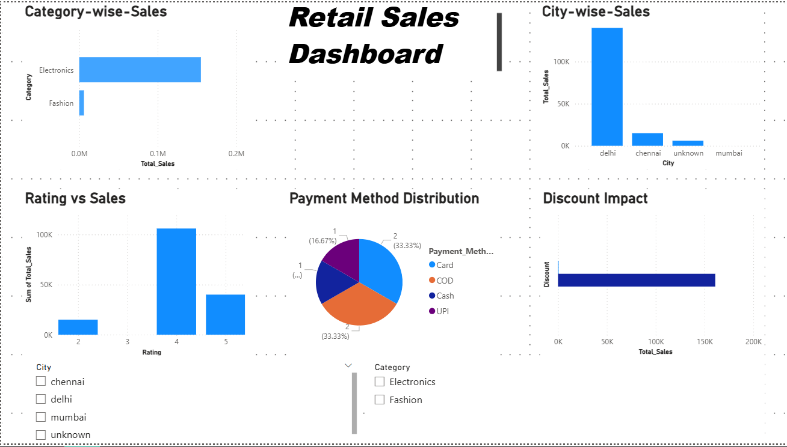

# Retail Sales Analysis Dashboard

## Overview
This project focuses on analyzing retail sales data using Python, SQL, and Power BI. It covers data cleaning, analysis, and dashboard creation.

## Tools Used
- Python (Pandas)
- SQL
- Power BI

## Project Workflow
- Data cleaning using Python
- Data analysis using SQL
- Data visualization using Power BI

## Key Insights
- Electronics category generated highest sales
- Delhi is the top-performing city
- Card and COD are the most used payment methods
- Discounts have a clear impact on total sales

## Files
- data/ (raw and cleaned datasets)
- scripts/ (Python scripts)
- Retail_Sales_Dashboard.pbix (Power BI dashboard)

- ## Dashboard Preview

